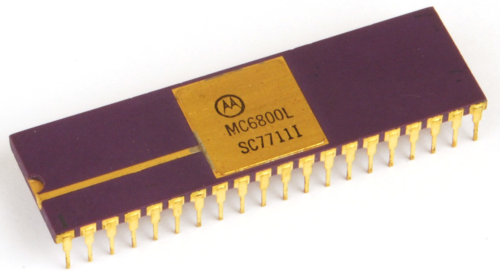

# Motorola MC680x microprocessor family

Motorola introduced the MC6800 8-bit processor in 1974.
It's instruction set was simple and clean - inspired by the PDP-8 - and it came with a family of associated memory and I/O devices which made it easy to build a complete computer system.

It was also the first microprocessor that could run on a single +5V power supply which greatly simplified the design of a complete system.
The 6800 was clocked at 1 MHz while an improved version could run at 2 MHz.
This interesting [Wikipedia](https://en.wikipedia.org/wiki/Motorola_6800){:target="_blank"} article describes the history of Motorola and how the 6800 was eventually created.

In 1978 Motorola introduced a greatly improved microprocessor, the [MC6809](https://en.wikipedia.org/wiki/Motorola_6809){:target="_blank"}.
It was an 8-bit processort with a richer instruction set and several 16-bit instructions.

One key diffence between the Motorola and Intel processors was the I/O addressing.
The Intel microprocessors used specific I/O ports seperate from regular memory space while the Motorola 680x microprocessers placed I/O devices in the RAM/ROM memory space and therefor needed no seperate I/O instructions.

# Motorola MC6800 Evaluation Kit II

After having played around with the Elektuur SC/MP II for a while, I was ready for a next step and bought a kit based on the MC6800, consisting of all the parts which had to be soldered on the provided PCB's.
Back then I was a teenager, so I had to safe up for buying this computer which costed the equivalent of around $ 350-400 if I remember correctly.

The MEK6800D2 was a development board for the Motorola 6800 microprocessor, produced by Motorola in 1976. It featured a keyboard with hexadecimal keys and a LED display, but also featured an RS-232 asynchronous serial interface for a Teletype or other terminal. There was an on-board debug program called JBUG fitted in a 1k ROM, and the maximum RAM capacity on board was 512 bytes, but this could be expanded via the Motorola EXORciser computer bus interface. There was also a parallel bus interface for general purpose I/O. Another popular monitor program for this system is called MIKBUG

## Overview

To help people getting to know the MC6800 family, Motorola introduced the **Motorola MEK6800D2 Evaluation Kit II** (MEK6800D2).
This Kit, when assembled, was a fully functional microcomputer system based on the MC6800 Microprocessing Unit (MPU).

I bought this Kit as my second microcomputer, after the National Semiconductor SC/MP II, and created various simple programs, inluding _Mastermind_.
The standard Kit, consiting of a Microcomputer Module and a Keyboard/Display Module, included:

* The MC6800 MPU.
* The JBUG monitor in a MCM6830 1K x  8 bit ROM (SCM44520P).
* 3 MCM6810 RAM Memory modules (128 x 8 bit).
* 2 MC6820 Peripheral Interface Adapters (PIA's)had some fun with it.

Because both the MPU and the serial interface use the same clock, the MPU is running at only 614.4 kHz generated by a MC6871B, even though it is capable of running at 1 MHz. This provides a simple means of obtaining a 4800 Hz clock for the 300 baud serial data tape cassette interface as well as the ACIA by just dividing the MC6871B provided double clock output by 256.

Programs could be stored on, and loaded from, ordinary audio cassettes using the "Kansas City Standard" recording format, so called due to its formulation during a symposium sponsored by _BYTE Magazine_ in Kansas City, Missouri, in November 1975.

## Overview of my inventory

Next to the Kit, I also have various manuals and books as well as alternative monitor programs and sample programs.
